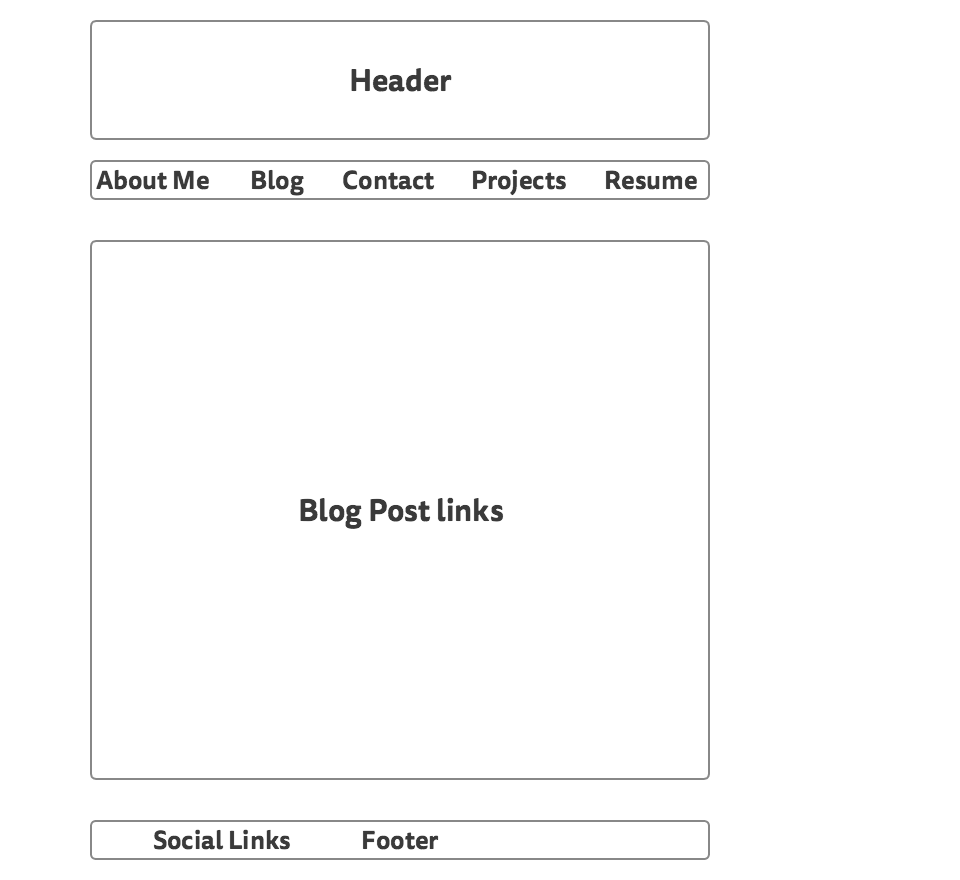

###1. What is a wireframe?

A wireframe is a rough sketch or outline of what the website will look like and function

###2. What are the benefits of wireframing?

Some benefits include understanding how the visitor will process the information. Make it easier to code by having the wireframe as a reference. Make changes easier after getting feedback from clients.

###3. Did you enjoy wireframing your site?

Yes, It allowed me to think about how I wanted the site to look like. It's nice to visually get an idea of what it'll look like. I'm not sure if this is the final version, but it's a good base to start on.

###4. Did you revise your wireframe or stick with your first idea?

I revised some elements of the design, and probably will do some more revisions later on.

###5. What questions did you ask during this challenge? What resources did you find to help you answer them?

I wanted to find a good mockup app that was free. I researched a bit on google and decided for now to use Mockingbird. It's easy to use and for this initial wireframe got the job done. I'll continue to look for an app with better save functionality for free.

###6. Which parts of the challenge did you enjoy and which parts did you find tedious?

I enjoyed creating my wireframe. It's great to get a visual idea of what the website will look like. I didn't find anything about the challenge that tedious. I went down a small rabbit hole looking for a wireframe app, but decided to use my time better.
