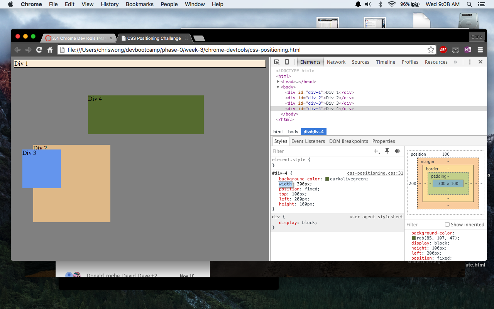
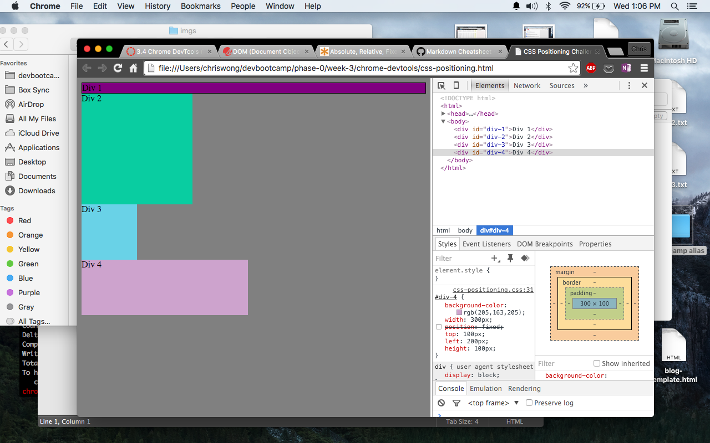
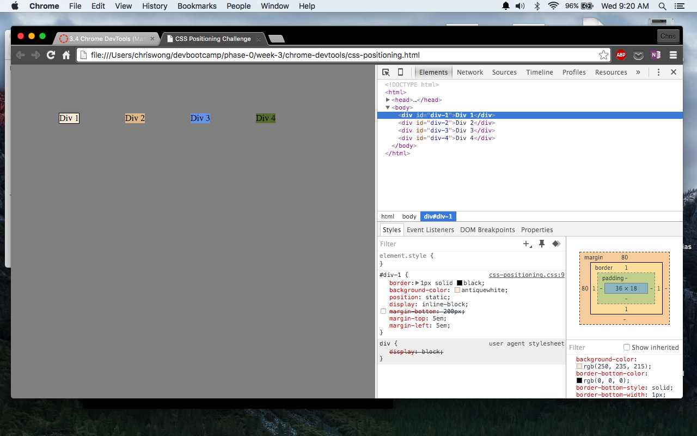
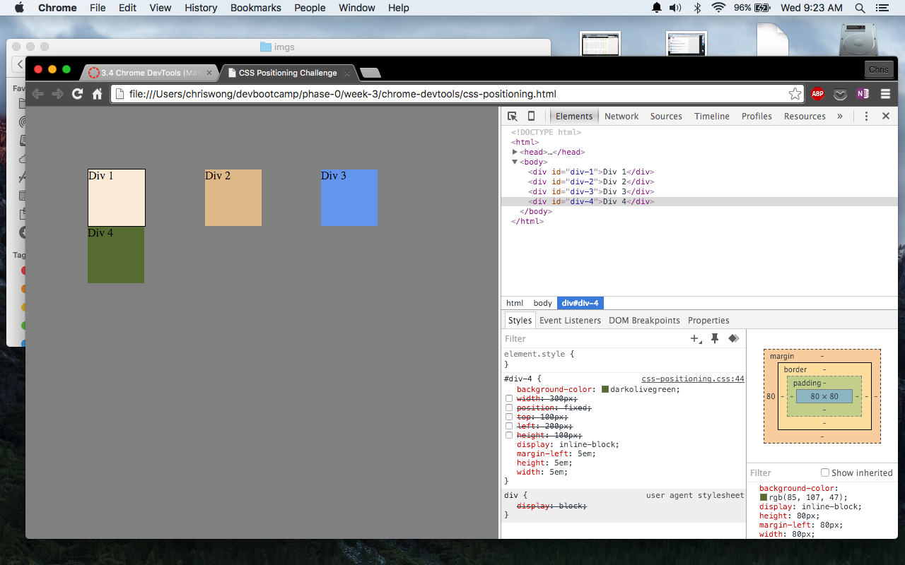
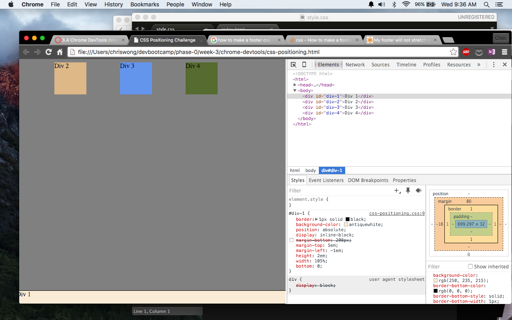
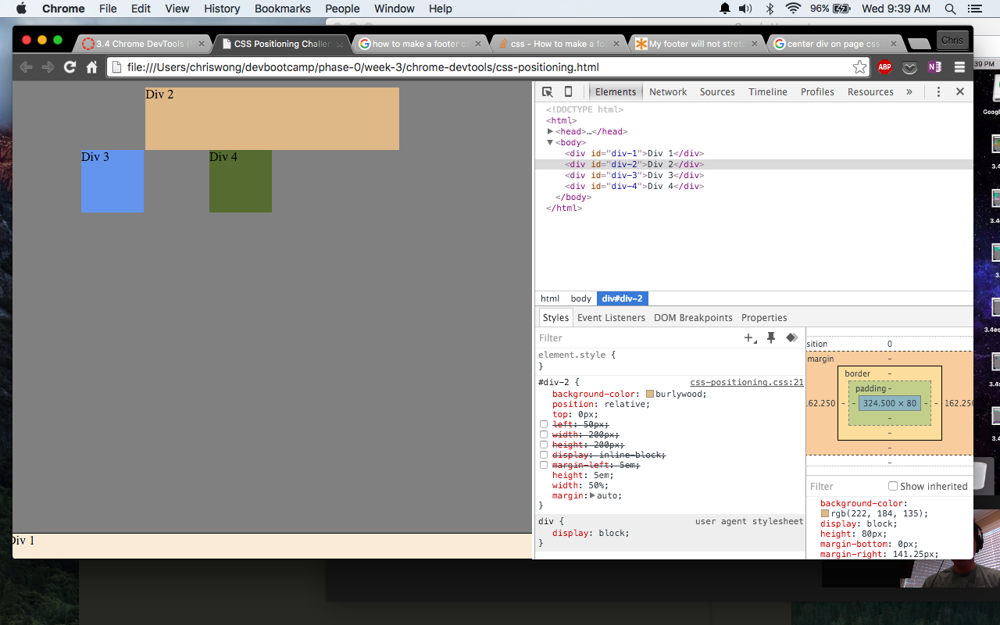
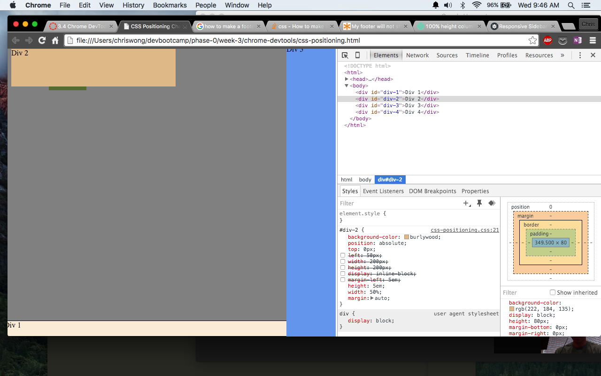
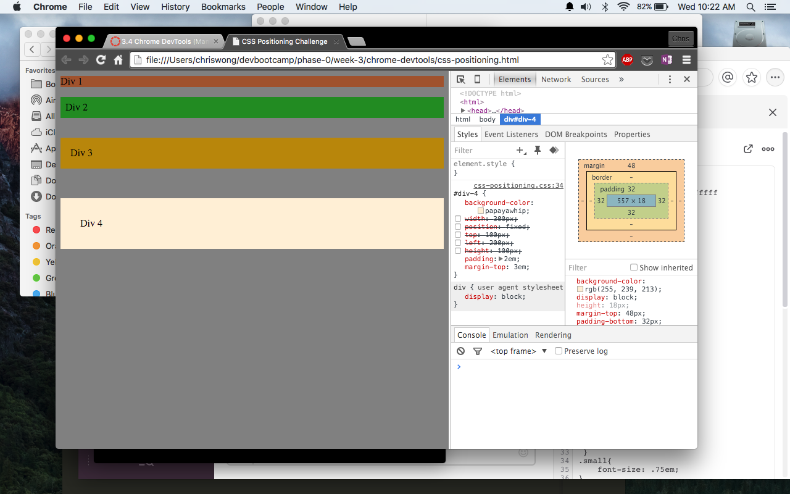

###How can you use Chrome's DevTools inspector to help you format or position elements?

It's a great tool for seeing what would happen if you want to make some quick edits. If you're working on a web page and notice the position of an element is off, you can use the DevTools to make a quick edit and preview the change without having to go through the whole sublime to browser workflow.

###How can you resize elements on the DOM using CSS?

You can resize elements on the DOM by manipulating the element properties in the CSS file with methods. For example if you wanted to change the width of a 
 element 20px you would assign a class to 
 with a width property (width: 20px).

###What are the differences between absolute, fixed, static, and relative positioning?

Absolute lets you place an element anywhere on the page relative to the next parent element with positioning.

Fixed is used to keep an element in a specific position regardless of where the browser window is viewing the page.

Static is the default state for a newly created element.

Relative is used to position the element based from its normal position. For example an element with a relative position of top: 10px would shift the element 10px below it's original spot.

###Which did you find easiest to use? Which was most difficult?

Static was the easiest since it's the default. The most difficult to use was the relative positioning since there are a lot of options when using it.

###What are the differences between margin, border, and padding?

Margin is the clear space outside of the element. Border is the edge of an element that surrounds the content and padding if any. Padding is the space between the content and the border.

###What was your impression of this challenge overall? (love, hate, and why?)

I liked this challenge. Mainly because it introduced ChromeDevTools. I really like how you can make changes and see what happens in real time. It is a powerful tool that we'll probably be using frequently.