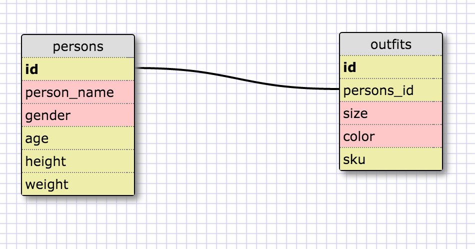

### Release 5

1. SELECT * FROM STATES;
2. SELECT * FROM REGIONS;
3. select state_name, population from states;
4. select state_name, population from states ORDER BY population desc;
5. select state_name, population_density from states where region_id  = 7;
6. select state_name, population_density from states where population_density>50 ORDER BY population_density asc;
7. select state_name from states where population between 1000000 and 1500000;
8. select state_name, region_id from states order by region_id asc;
9. select region_name from regions where region_name like '%central%';
10. select regions.region_name, states.state_name FROM regions INNER JOIN states ON regions.id = states.region_id;

### Release 6

### Release 7

### What are databases for?
Databases are for storing large amounts of information that have similar characteristics. It makes it easier and more efficient to sort through repeatable data.

### What is a one-to-many relationship?
A one-to-many relationship is where a single element is linked to many other elements in a separate object. Like Region to States.

### What is a primary key? What is a foreign key? How can you determine which is which?
The primary key is the main identifier for the table. A foreign key is a key in a table that links it with another table's primary key. You can tell which is which because the primary key will be the id of the table, where as the foreign key will be named something else.

### How can you select information out of a SQL database? What are some general guidelines for that?
You can select information out of a SQL database by using query commands. Some general guidelines is to start with what information you want to select, followed by the table you're getting it from. Also end all queries with a semicolon.
