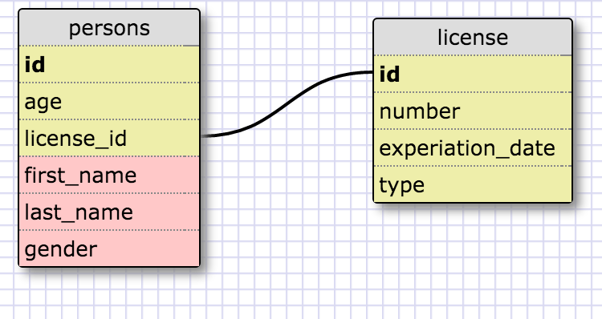
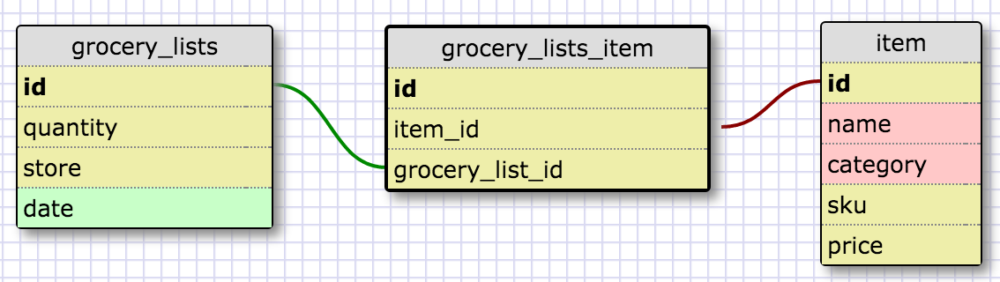

### Release 2:

This is an example of a one-to-one relationship. Each person can have driver's license. However a person may only have one license. Each license can only be associated with one person.

### Release 4:

### Reflection

### What is a one-to-one database?
A one-to-one database as a database relationship where two things have a singular relationship with one another. Essentially a pair.

### When would you use a one-to-one database? (Think generally, not in terms of the example you created).
You would use a one-to-one database relationship when you want to have data that is only associated with a table, but that table doesn't have to have that data for each entry. So an entry in that table can have a relationship with the data, but it's not required.

### What is a many-to-many database?
Many-to-many database is where two or more sets of tables with fields that are related to each other.

### When would you use a many-to-many database? (Think generally, not in terms of the example you created).
You would use many-to-many when you have two databases with multiple relationships that you need to connect.

### What is confusing about database schemas? What makes sense?
The one-to-one relationship is confusing since it's hard to know when you would use it. Logically everything makes sense, it's just hard to identify when each type of relationship should be used.
